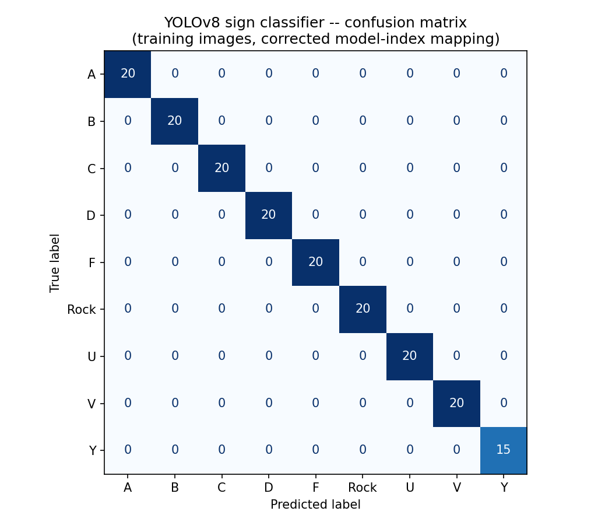
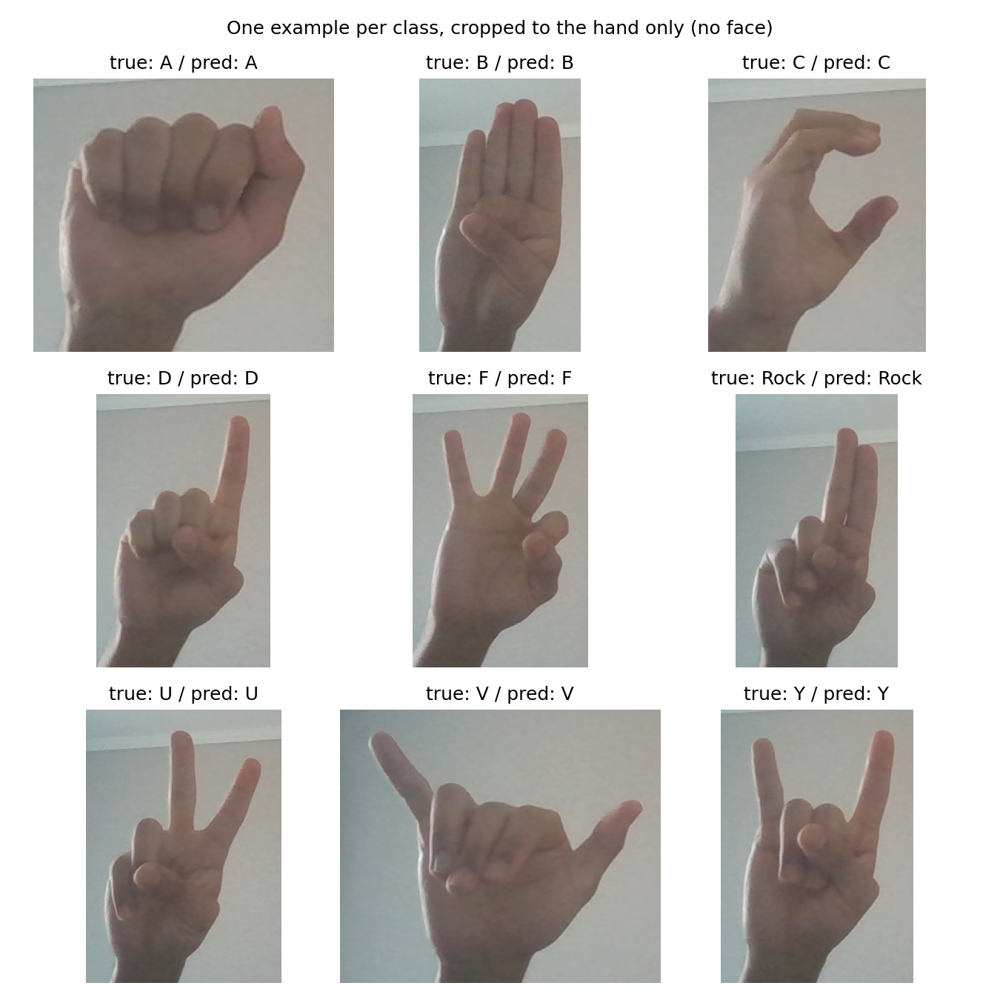

# Hand Gesture & Sign Language Recognition

Real-time computer vision system that detects hand landmarks and body pose from a webcam feed, and classifies hand shapes into sign-language letters using a custom-trained YOLOv8 model.

## Results



Evaluated on the 180 training images (no separate held-out test set exists from the original Roboflow training, so this measures fit-to-training-examples, not generalization to new photos) -- 175/180 got a detection, and every one of those was classified correctly.

**Found and fixed a real bug in the process:** the `labels` dict used to turn the model's raw output index into a letter (in `useCode.ipynb`) didn't match the model's actual internal class ordering for 4 of the 9 signs -- Rock/U/V/Y were cyclically shifted, so the live demo would have shown the wrong letter for any of those four signs. Before the fix, raw accuracy was 57.1% (A-D and F were fine; Rock/U/V/Y were each consistently displayed as a different one of the same four). The bug was invisible without checking predictions against known labels, since the model was actually working correctly, just with a wrong index-to-letter table downstream.


*(cropped to the hand only -- the source webcam captures are close-up selfies with the face in frame, see "Training data" below)*

**Baseline comparison:** a much lighter alternative -- MediaPipe hand landmarks (21 points, no GPU) plus a `RandomForestClassifier` -- reaches 98.3% ± 2.2% accuracy under 5-fold cross-validation (a genuinely held-out measure, unlike the YOLOv8 number above). MediaPipe also detected a hand in all 180 images, 5 more than YOLOv8. The two are practically tied on accuracy; the landmark baseline is far cheaper to run and was evaluated more rigorously, so it's the better choice if the goal is just classifying an already-cropped hand shape rather than also locating the hand in the frame (which is what YOLOv8 adds).

Full code for both the confusion matrix and the baseline is in `codigos/useCode.ipynb`, under "Evaluacion" -- runs on the static training images, no webcam needed.

## What it does

- **Hand tracking**: uses MediaPipe Hands to detect 21 hand landmarks per hand in real time, draw a bounding box, tell left hand from right hand, and highlight selected landmarks.
- **Sign language classification**: a YOLOv8 model (`signLenguage_Model.pt`), trained on a custom dataset built from webcam captures and labeled/trained via Roboflow, predicts 9 sign-language letters (A, B, C, D, F, Rock, U, V, Y) from the live video stream.
- **Body pose tracking**: a MediaPipe Pose variant that tracks full-body landmarks and draws a bounding box around the detected person.
- **Data collection pipeline**: `collect_imgs.py` captures and saves labeled webcam images per gesture class into `Data/<class_id>/`, which is the raw dataset used to train the classifier.

## Training data

9 classes (`A, B, C, D, F, Rock, U, V, Y`), 20 webcam captures each. **Not included here** — the captures are close-up selfie-style photos, so they stay private outside the repo (`datos/bases/Hand_gesture/` in `modelo_de_trabajo`) rather than being published alongside the code.

## Tech stack

Python, OpenCV, MediaPipe, Ultralytics YOLOv8, NumPy.

## Project structure

```
codigos/
  Codes.py              # Reusable hand-tracking function (production/library version)
  collect_imgs.py        # Webcam-based dataset collection tool
  useCode.ipynb          # Usage notebook: hand tracking, sign classification, body pose demos,
                          # plus an "Evaluacion" section (confusion matrix, landmarks baseline)
datos/resultados/
  signLenguage_Model.pt   # Trained YOLOv8 weights (50MB — see note below)
  confusion_matrix.png    # YOLOv8 evaluation (see "Results" above)
  predictions_sample.png  # One correctly-classified example per class, cropped to the hand
requirements.txt
```

Training images and their source path live outside this repo — see "Training data" above.

## How to run

```bash
pip install -r requirements.txt
```

Open `codigos/useCode.ipynb` and run the cells for the demo you want:

1. **Hand detection** — tracks hand landmarks, numbers them, and can recolor specific points.
2. **Hand gesture / sign language** — loads `datos/resultados/signLenguage_Model.pt` and classifies the sign shown to the webcam.
3. **Body detection** — tracks full-body pose landmarks.

To collect new training data for additional gesture classes, run `codigos/collect_imgs.py` (adjust `number_of_classes` and `dataset_size` first) — it saves to `datos/bases/Hand_gesture/Data/` outside the repo — and retrain the YOLOv8 model on that folder (originally done via Google Colab + Roboflow).

`Codes.py` also contains an experimental branch (see `useCode.ipynb`, cell 2) that combines hand tracking with speech recognition and an LLM call to build a hands-free "ask a question" interaction — the API key for that part must be supplied separately and is not included here.

## Note on the model file

`signLenguage_Model.pt` is 50MB — committed directly (under GitHub's 100MB hard limit). No Git LFS.
